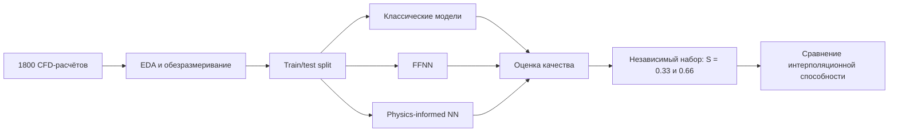

# Physics-informed surrogate model for pressure-drop estimation in vascular stenosis

Проект выпускной квалификационной работы по разработке модели, которая оценивает **безразмерный перепад давления в области стеноза сосуда** по геометрическим и гемодинамическим параметрам.

Основная идея — заменить многократные вычислительно дорогие 3D CFD-расчёты быстрым surrogate-моделированием и проверить, помогает ли добавление физических ограничений улучшить поведение нейросети на параметрах, отсутствовавших в обучающей сетке.

**Автор:** Анастасия Осипова  
**ВКР:** «Физически-информированная нейронная сеть для оценки перепада давлений в области сужения просвета сосуда»  
**Первый МГМУ им. И. М. Сеченова, 2026**

---

## Постановка задачи

Стеноз изменяет структуру течения и приводит к дополнительным потерям давления. Прямое измерение перепада давления является инвазивным, а проведение отдельного 3D CFD-расчёта для каждой геометрии требует значительных вычислительных ресурсов.

В проекте решается задача регрессии:

\[
(Re,\ L_{st}/R_0,\ S,\ \alpha) \longrightarrow \Delta P^*,
\]

где:

- `Re` — число Рейнольдса;
- `L_st/R_0` — относительная длина стеноза;
- `S` — степень стеноза по диаметру;
- `α` — параметр асимметрии;
- `ΔP*` — безразмерный перепад давления.

Целевая переменная вычисляется как

\[
\Delta P^*=\frac{\Delta P}{\rho u^2}.
\]

Безразмерная форма уменьшает зависимость результата от выбранной системы единиц и позволяет моделировать общую связь между режимом течения, геометрией стеноза и потерями давления.

---

## Что реализовано

- разведочный анализ CFD-данных;
- расчёт безразмерного перепада давления;
- анализ распределений, выбросов и корреляций;
- обучение классических моделей регрессии;
- подбор гиперпараметров с `GridSearchCV` и групповой кросс-валидацией;
- реализация полносвязной нейросети в PyTorch;
- реализация physics-informed loss через автоматическое дифференцирование;
- сравнение PINN и обычной FFNN при одинаковой инициализации;
- проверка на независимой интерполяционной выборке;
- сохранение обученных моделей и объектов масштабирования;
- функции препроцессинга и инференса для новых наборов параметров.



---

## Данные

В работе используется синтетическая база из **1800 стационарных CFD-расчётов**, сформированная в SimVascular как полная параметрическая сетка:

| Параметр | Значения |
|---|---|
| `Re` | 30, 50, 100, 200, 300, 400, 500, 600, 700, 800 |
| `L_st/R_0` | 2.5, 5, 10, 15, 20, 30 |
| `S` | 0.0–0.9 с шагом 0.1 |
| `α` | 0.0, 0.5, 1.0 |

Полная сетка содержит `10 × 6 × 10 × 3 = 1800` комбинаций.

Для независимой проверки используется отдельный набор из **240 CFD-наблюдений**:

- степени стеноза `S = 0.33` и `S = 0.66`, отсутствующие в обучающей сетке;
- относительные длины стеноза `4, 8, 17, 25`;
- те же десять значений `Re`;
- три уровня асимметрии.

Такое тестирование позволяет оценить не только качество на случайном hold-out, но и способность модели интерполировать между дискретными уровнями параметров.

### Файлы данных

- `datasets/data.csv` — исходные размерные CFD-данные;
- `datasets/data4_2.csv` — подготовленный набор с безразмерной целевой переменной;
- `datasets/data_test2.csv` — независимый интерполяционный тест.

---

## Разведочный анализ

В `src/eda.ipynb` выполнены:

- проверка типов данных, пропусков и дубликатов;
- описательная статистика;
- анализ сильно правостороннего распределения `ΔP`;
- переход к `log(1 + ΔP*)` для стабилизации масштаба целевой переменной;
- сравнение распределений для разных степеней стеноза и асимметрии;
- корреляционный анализ Пирсона и Спирмена;
- визуализация зависимости перепада давления от степени стеноза и числа Рейнольдса.

Ключевое наблюдение: степень стеноза является главным фактором изменения перепада давления, а при больших значениях `S` целевая переменная возрастает на несколько порядков. Поэтому обучение только в исходной шкале смещает MSE в сторону наиболее тяжёлых стенозов.

---

## Классические модели

В `src/classic_models.ipynb` реализованы:

- Ridge Regression;
- K-Nearest Neighbors;
- Random Forest;
- Gradient Boosting;
- XGBoost.

Для целевой переменной применяется `log1p`, а для Ridge и KNN — масштабирование входных признаков. Подбор гиперпараметров деревьев и бустингов проводится с помощью `GridSearchCV`.

В кросс-валидации используется `GroupKFold`: группы формируются по сочетанию степени и относительной длины стеноза. Это снижает риск получить чрезмерно оптимистичную оценку из-за близких геометрических режимов в соседних фолдах.

На обычном случайном разделении лучший результат среди классических моделей показал XGBoost:

| Модель | R² | MAE | RMSE | WAPE |
|---|---:|---:|---:|---:|
| XGBoost | 0.9989 | 24 | 89 | 2.69% |
| Gradient Boosting | 0.9981 | 28 | 114 | 3.15% |
| Random Forest | 0.9963 | 35 | 162 | 3.99% |

При этом качество деревьев заметно снижается на независимых промежуточных значениях степени стеноза, что стало основной мотивацией для проверки гладкой нейросетевой аппроксимации.

---

## Нейросетевая модель

### Архитектура

Обе нейросети имеют одинаковую архитектуру:

```text
Input(4) → Linear(16) → Tanh → Linear(16) → Tanh → Linear(1)
```

Вход модели:

```text
[log(Re), L_st/R_0, S, α]
```

Выход модели — масштабированное значение `log(1 + ΔP*)`.

Перед обучением:

- `Re` логарифмируется;
- признаки масштабируются через `MinMaxScaler`;
- целевая переменная преобразуется через `log1p` и также масштабируется;
- PINN и FFNN получают одинаковые стартовые веса и одинаковое начальное состояние Adam, что делает сравнение корректнее.

### Physics-informed loss

В данном проекте физическая информированность реализована не через прямое решение уравнений Навье—Стокса, а через **мягкие ограничения на знак предсказания и производных модели**.

Ожидаемые зависимости:

\[
\Delta P^* \geq 0,
\]

\[
\frac{\partial \Delta P^*}{\partial Re} \leq 0,
\qquad
\frac{\partial \Delta P^*}{\partial (L_{st}/R_0)} \geq 0,
\]

\[
\frac{\partial \Delta P^*}{\partial S} \geq 0,
\qquad
\frac{\partial \Delta P^*}{\partial \alpha} \geq 0.
\]

Производные выхода по входным признакам вычисляются с помощью `torch.autograd`. Нарушения ожидаемых знаков штрафуются через `ReLU`:

\[
L = L_{data} + w_{phys}L_{phys}.
\]

Вес физического штрафа вводится постепенно:

- первые 2000 эпох: `w_phys = 0`;
- с 2000-й до 10000-й эпохи: линейное увеличение;
- после 10000-й эпохи: `w_phys = 0.1`.

Такой warm-up позволяет сначала приблизить данные, а затем постепенно усилить физическую регуляризацию.

> Технически модель точнее описывать как physics-informed surrogate model или PINN-style regression model: она обучается по CFD-таргетам и использует физические ограничения, но не минимизирует PDE-residual внутри расчётной области.

---

## Результаты

### Случайный hold-out из основной CFD-сетки

| Метрика | PINN | FFNN |
|---|---:|---:|
| R² | **0.998160** | 0.997622 |
| MAE | **29.4559** | 33.4489 |
| RMSE | **113.7951** | 129.3789 |
| WAPE | **3.37%** | 3.82% |
| MAPE | 4.89% | **4.68%** |

PINN показывает меньшие MAE, RMSE и WAPE. Небольшое преимущество FFNN по MAPE связано с высокой чувствительностью этой метрики к малым истинным значениям.

### Независимый интерполяционный тест

| Метрика | PINN | FFNN |
|---|---:|---:|
| R² | **0.998153** | 0.997909 |
| MAE | **1.354216** | 1.464466 |
| RMSE | **2.656022** | 2.825449 |
| WAPE | **2.96%** | 3.20% |
| MAPE | **4.58%** | 4.80% |

На независимых значениях `S = 0.33` и `S = 0.66` physics-informed модель сохраняет высокую точность и немного превосходит FFNN по всем приведённым метрикам.

Для сравнения, на этом же тесте сохранённые классические модели показали более слабую интерполяцию:

| Модель | R² | MAE | RMSE | WAPE |
|---|---:|---:|---:|---:|
| KNN | 0.9015 | 8.9839 | 19.3904 | 19.64% |
| Gradient Boosting | 0.7169 | 21.8908 | 32.8777 | 47.85% |
| Random Forest | 0.7069 | 22.4193 | 33.4532 | 49.00% |
| XGBoost | 0.5866 | 22.1931 | 39.7327 | 48.51% |
| Ridge | -0.3947 | 46.8777 | 72.9767 | 102.47% |

Главный практический результат: **высокая точность на случайном split ещё не гарантирует хорошую работу между узлами исходной параметрической сетки**. Независимая проверка показала преимущество гладких нейросетевых моделей над деревьями решений в этой постановке.

---

## Структура репозитория

```text
stenosis_ml/
├── datasets/
│   ├── data.csv                  # исходные размерные CFD-данные
│   ├── data4_2.csv               # основной набор с ΔP*
│   └── data_test2.csv            # независимый тест
├── models/
│   ├── all_models2.joblib        # классические модели
│   ├── ffnn/
│   │   ├── ffnn_model.pth
│   │   ├── scaler_X_ffnn.pkl
│   │   └── scaler_y_ffnn.pkl
│   └── pinn/
│       ├── pinn_model.pth
│       ├── scaler_X_pinn.pkl
│       └── scaler_y_pinn.pkl
└── src/
    ├── eda.ipynb                 # анализ и подготовка данных
    ├── classic_models.ipynb      # классические ML-модели
    └── neural_network.ipynb      # FFNN, PINN, обучение и инференс
```

---

## Запуск проекта

### 1. Создать окружение

```bash
cd stenosis_ml
python -m venv .venv
```

Активация в Linux/macOS:

```bash
source .venv/bin/activate
```

Активация в Windows PowerShell:

```powershell
.venv\Scripts\Activate.ps1
```

### 2. Установить зависимости

```bash
pip install numpy pandas matplotlib seaborn scikit-learn xgboost torch joblib jupyter
```

Рекомендуемая версия Python: **3.10+**.

### 3. Запустить Jupyter

```bash
jupyter lab
```

Рекомендуемый порядок просмотра:

1. `src/eda.ipynb`;
2. `src/classic_models.ipynb`;
3. `src/neural_network.ipynb`.

### Важно

Ноутбуки рассчитаны на запуск из каталога `src`. В текущей структуре данные находятся в `datasets/`, поэтому пути в `neural_network.ipynb` должны быть:

```python
../datasets/data4_2.csv
../datasets/data_test2.csv
```

Если в отдельных ячейках сохранилось старое имя каталога `../data/`, его необходимо заменить на `../datasets/`.

---

## Сохранённые модели

Классические модели сериализованы в одном файле:

```text
models/all_models2.joblib
```

Для PINN и FFNN отдельно сохранены:

- `state_dict` модели PyTorch;
- scaler входных признаков;
- scaler целевой переменной.

При инференсе необходимо повторить тот же pipeline:

```text
Re → log(Re) → scaling X → neural network → inverse scaling y → expm1 → ΔP*
```

---

## Что демонстрирует проект

С точки зрения ML/DS проект включает полный экспериментальный цикл:

- постановку инженерной задачи как supervised regression;
- физически осмысленную обработку таргета;
- EDA и анализ распределений;
- построение baseline-моделей;
- настройку гиперпараметров;
- разработку модели в PyTorch;
- работу с производными выхода по входам через autograd;
- проектирование составной функции потерь;
- контроль воспроизводимости;
- оценку не только на random split, но и на отдельном interpolation test;
- сериализацию моделей и подготовку инференса.

---

## Ограничения

- данные являются синтетическими и получены из параметрических CFD-расчётов;
- рассмотрены упрощённые геометрии стеноза;
- моделируется стационарный режим, без временной структуры пульсирующего кровотока;
- физические ограничения заданы как монотонные зависимости и не заменяют полный PDE-residual;
- модель не проходила клиническую валидацию и не предназначена для принятия медицинских решений.

---

## Возможное развитие

- расширение CFD-базы более сложными и пациент-специфичными геометриями;
- добавление пульсирующего режима и временных рядов;
- прогноз пространственных полей скорости и давления;
- сравнение с Gaussian Processes и monotonic gradient boosting;
- uncertainty estimation и анализ областей экстраполяции;
- вынесение обучения и инференса из ноутбуков в Python-модули;
- добавление CLI/API и автоматизированных тестов;
- интеграция surrogate-модели как локальной поправки в 1D-модель гемодинамики.

---

## Краткий вывод

Разработанная physics-informed нейросеть воспроизводит CFD-зависимость перепада давления и сохраняет высокую точность на промежуточных значениях параметров, отсутствовавших в исходной обучающей сетке. Физический штраф даёт небольшое, но устойчивое улучшение по сравнению с обычной FFNN, а независимый тест показывает, почему для научного ML важно проверять не только случайное разбиение данных, но и реальный сценарий интерполяции.
